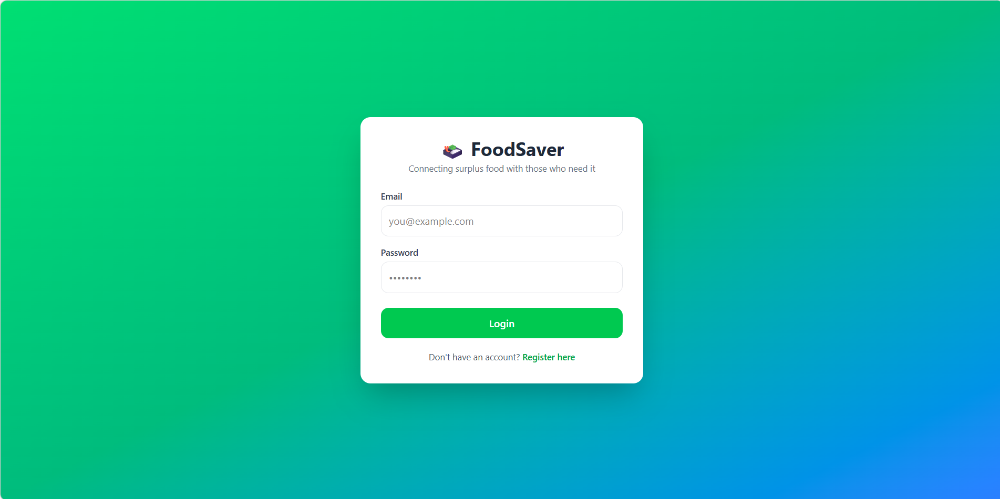
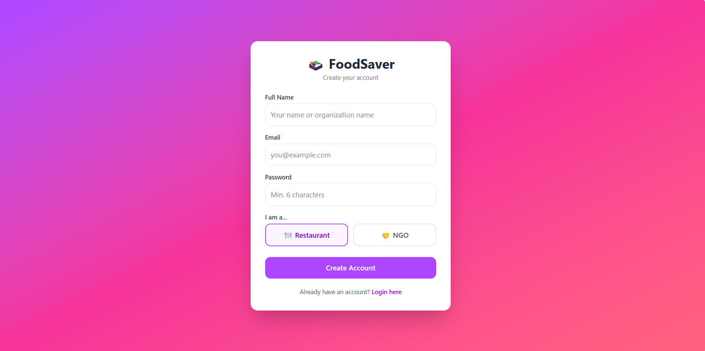
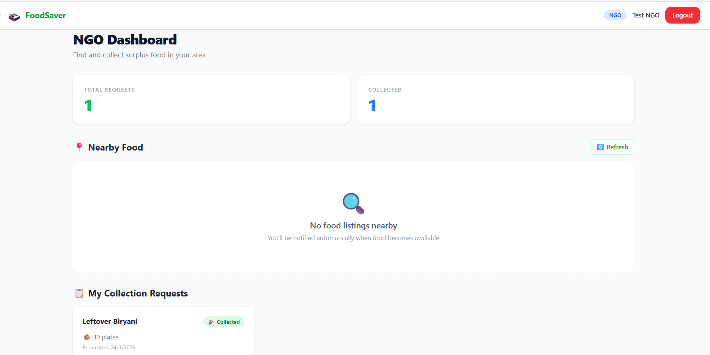
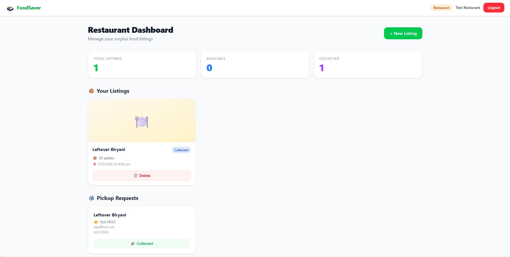
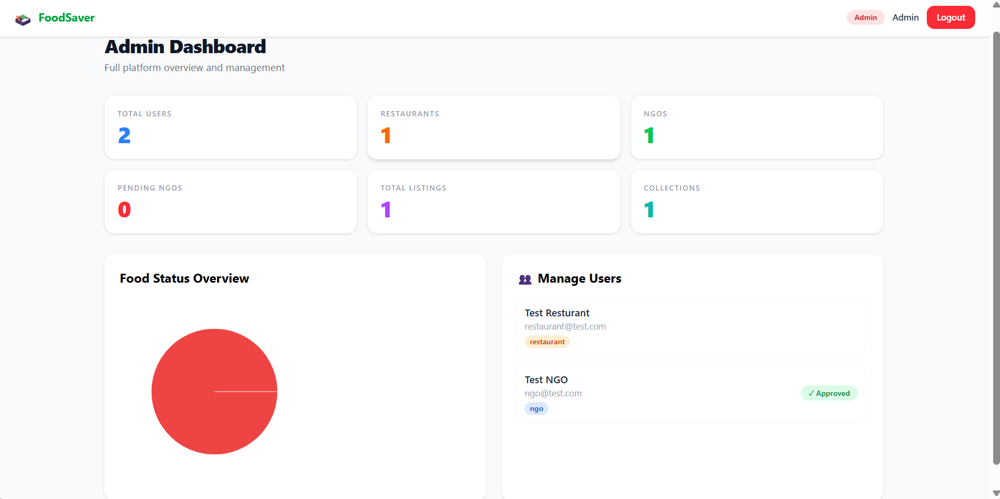

# 🍱 FoodSaver — Food Waste Management Platform

A full-stack MERN application that connects restaurants and event organizers with nearby NGOs to reduce food waste. When surplus food is available, it gets listed on the platform, nearby NGOs are notified in real-time and can request collection — getting food to people who need it before it goes to waste.

---

## 🌐 Live Demo

👤 **App:** https://food-waste-management-zeta.vercel.app/

---

## 📸 Screenshots

### 🏠 Login Page


### 👨‍⚕️ Register Page


### 📅 NGO Dashboard


### 👨‍⚕️ Restaurant Dashboard


### 🛡️ Admin Dashboard


---

## ✨ Features

### 🔐 Authentication & Authorization
- JWT-based login and registration for all user roles
- Role-based access control (Admin, Restaurant, NGO)
- NGO accounts require Admin approval before login
- Secure password hashing with bcrypt
- Protected routes on both frontend and backend

### 🍽️ Restaurant / Event Organizer
- Create food listings with title, quantity, expiry time, description and address
- Pin exact pickup location on an interactive map (Leaflet + OpenStreetMap)
- Upload food images via Cloudinary
- View, manage and delete your own listings
- See all NGO pickup requests in real-time
- Approve or reject collection requests
- Dashboard stats showing total, active and collected listings

### 🤝 NGO
- View all available food listings near your location (geolocation-based)
- Request pickup for any available listing
- Get real-time notifications when new food is posted nearby
- Track collection request status (Pending → Approved → Collected)
- Mark collections as complete after pickup
- Dashboard showing total requests and completed collections

### 🛠️ Admin
- Approve or reject NGO registrations
- View all registered users (restaurants and NGOs) with role badges
- Monitor all food listings across the platform
- Dashboard with live stats: total users, restaurants, NGOs, listings and collections
- Pie chart breakdown of collection statuses (Requested / Approved / Collected)

### 🔔 Real-Time Notifications (Socket.io)
- NGO requests pickup → restaurant sees new request card instantly (no refresh needed)
- Restaurant approves → NGO sees status change and "Mark Collected" button instantly
- NGO marks collected → restaurant sees updated status instantly
- Toast notifications for every real-time event

### 🗺️ Location Features
- NGOs search for nearby food using browser geolocation
- MongoDB geospatial queries ($near) to find listings within a set distance
- Interactive map for restaurants to pin exact pickup location
- Distance-based filtering (default: 100km radius)

---

## 🏗️ Tech Stack

| Layer | Technology |
|---|---|
| Frontend | React.js (Vite), Tailwind CSS |
| Backend | Node.js, Express.js |
| Database | MongoDB, Mongoose ODM |
| Real-time | Socket.io |
| Authentication | JWT, bcrypt |
| Maps | Leaflet.js + OpenStreetMap |
| Image Upload | Cloudinary |
| State Management | React Context API |
| HTTP Client | Axios |
| Notifications | react-hot-toast |

---

## 📁 Project Structure

```
food-waste-management/
├── backend/
│   ├── config/
│   │   └── db.js                  # MongoDB connection
│   ├── controllers/
│   │   ├── adminController.js     # Admin stats, user management
│   │   ├── authController.js      # Register, login
│   │   ├── collectionController.js # Pickup request lifecycle
│   │   └── foodController.js      # CRUD for food listings
│   ├── middleware/
│   │   └── authMiddleware.js      # JWT protect + role authorization
│   ├── models/
│   │   ├── Collection.js          # Pickup request model
│   │   ├── FoodListing.js         # Food listing + geospatial index
│   │   ├── Notification.js        # Notification model
│   │   └── User.js                # User model + geospatial index
│   ├── routes/
│   │   ├── adminRoutes.js
│   │   ├── authRoutes.js
│   │   ├── collectionRoutes.js
│   │   └── foodRoutes.js
│   ├── sockets/
│   │   └── socketHandler.js       # Socket.io room management
│   ├── utils/
│   │   └── generateToken.js       # JWT token generator
│   └── server.js                  # Express app entry point
│
├── frontend/
│   └── src/
│       ├── components/
│       │   ├── AdminStats.jsx       # Pie chart component
│       │   ├── AdminUsers.jsx       # NGO approval table
│       │   ├── FoodForm.jsx         # Create listing form + map
│       │   ├── ListingCard.jsx      # Individual listing card
│       │   ├── Listings.jsx         # Restaurant's listing grid
│       │   ├── LoadingSpinner.jsx   # Reusable loader
│       │   ├── MapPicker.jsx        # Leaflet map for location pin
│       │   ├── MyCollections.jsx    # NGO collection tracker
│       │   ├── Navbar.jsx           # Top nav with role badge
│       │   ├── NearbyListings.jsx   # NGO nearby food grid
│       │   ├── ProtectedRoute.jsx   # Auth guard component
│       │   ├── Requests.jsx         # Restaurant pickup requests
│       │   └── StatsCard.jsx        # Reusable stat card
│       ├── context/
│       │   ├── AuthContext.jsx      # Global auth state
│       │   └── SocketContext.jsx    # Global socket connection
│       ├── hooks/
│       │   └── useRealtime.js       # Socket event auto-refresh hook
│       ├── pages/
│       │   ├── AdminDashboard.jsx
│       │   ├── Dashboard.jsx        # Role-based dashboard router
│       │   ├── Login.jsx
│       │   ├── NGODashboard.jsx
│       │   ├── Register.jsx
│       │   └── ResturantDashboard.jsx
│       ├── services/
│       │   └── api.js               # Axios instance + token interceptor
│       └── App.jsx                  # Routes
│
└── README.md
```

---

## ⚙️ Local Setup

### Prerequisites

Make sure you have these installed:
- [Node.js](https://nodejs.org/) (v18 or higher)
- [MongoDB](https://www.mongodb.com/) (local) or a [MongoDB Atlas](https://www.mongodb.com/cloud/atlas) account
- [Git](https://git-scm.com/)

---

### Step 1 — Clone the repository

```bash
git clone https://github.com/raj-balram/food-waste-management.git
cd food-waste-management
```

---

### Step 2 — Backend setup

```bash
cd backend
npm install
```

Create a `.env` file inside the `backend/` folder:

```env
PORT=5000
MONGO_URI=mongodb://localhost:27017/foodwaste
JWT_SECRET=your_super_secret_jwt_key_here
ADMIN_EMAIL=admin@foodsaver.com
ADMIN_PASSWORD=admin123
```

> ⚠️ For MongoDB Atlas, replace `MONGO_URI` with your Atlas connection string.
> ⚠️ Change `JWT_SECRET` to a long random string in production.

Start the backend server:

```bash
npm run dev
```

You should see:
```
Server running on port 5000
MongoDB Connected: localhost
```

---

### Step 3 — Frontend setup

Open a second terminal:

```bash
cd frontend
npm install
npm run dev
```

You should see:
```
Local: http://localhost:5173
```

---

### Step 4 — Cloudinary setup (for image uploads)

1. Create a free account at [cloudinary.com](https://cloudinary.com)
2. Go to **Settings → Upload → Upload presets**
3. Create a preset named `food_app` and set it to **Unsigned**
4. Copy your **Cloud Name**
5. In `frontend/src/components/FoodForm.jsx`, replace `YOUR_CLOUD_NAME`:

```js
const res = await fetch(
  "https://api.cloudinary.com/v1_1/YOUR_CLOUD_NAME/image/upload",
  ...
)
```

> Image upload is optional — listings work without images.

---

### Step 5 — Open the app

Go to [http://localhost:5173](http://localhost:5173)

**Create accounts to test:**

| Role | How to create |
|---|---|
| Restaurant | Register with role "Restaurant" |
| NGO | Register with role "NGO", then approve from Admin |
| Admin | Use credentials from your `.env` file |

---

## 🔄 How It Works — Full Flow

```
1. Restaurant creates a food listing with location pin
        ↓
2. All NGOs in the area receive a real-time toast notification
        ↓
3. NGO sees the listing in "Nearby Food" and clicks "Request Pickup"
        ↓
4. Restaurant sees the request instantly (no page refresh) and clicks "Approve"
        ↓
5. NGO sees approval instantly and clicks "Mark as Collected"
        ↓
6. Restaurant sees "Collected" status instantly
        ↓
7. Admin can monitor all activity from the Admin Dashboard
```

---

## 🔌 API Endpoints

### Auth
| Method | Endpoint | Access | Description |
|---|---|---|---|
| POST | `/api/auth/register` | Public | Register new user |
| POST | `/api/auth/login` | Public | Login and get JWT token |

### Food Listings
| Method | Endpoint | Access | Description |
|---|---|---|---|
| GET | `/api/food` | All roles | Get all listings |
| POST | `/api/food` | Restaurant | Create new listing |
| GET | `/api/food/my` | Restaurant | Get own listings |
| GET | `/api/food/nearby` | NGO | Get nearby listings (geolocation) |
| GET | `/api/food/:id` | All roles | Get single listing |
| PUT | `/api/food/:id` | Restaurant (owner) | Update listing |
| DELETE | `/api/food/:id` | Restaurant (owner) | Delete listing |
| PATCH | `/api/food/:id/status` | All roles | Update listing status |

### Collections (Pickup Requests)
| Method | Endpoint | Access | Description |
|---|---|---|---|
| GET | `/api/collection` | Restaurant | Get all incoming requests |
| GET | `/api/collection/ngo` | NGO | Get own collection requests |
| POST | `/api/collection/:id/request` | NGO | Request pickup for a listing |
| PUT | `/api/collection/:id/approve` | Restaurant | Approve a pickup request |
| PUT | `/api/collection/:id/complete` | NGO | Mark as collected |

### Admin
| Method | Endpoint | Access | Description |
|---|---|---|---|
| GET | `/api/admin/users` | Admin | Get all users |
| PUT | `/api/admin/approve/:id` | Admin | Approve NGO registration |
| GET | `/api/admin/stats` | Admin | Get platform statistics |

---

## 🔒 Environment Variables Reference

```env
# backend/.env

PORT=5000                          # Server port
MONGO_URI=                         # MongoDB connection string
JWT_SECRET=                        # Secret key for signing JWT tokens (make it long and random)
ADMIN_EMAIL=admin@foodsaver.com    # Admin login email
ADMIN_PASSWORD=                    # Admin login password
```

> Never commit your `.env` file to GitHub. It is already in `.gitignore`.

---

## 🚀 Future Improvements

These features are planned for upcoming versions:

### Security
- [ ] Rate limiting on auth routes to prevent brute-force attacks
- [ ] `helmet.js` for secure HTTP headers
- [ ] Input sanitization and validation (express-validator)
- [ ] Password strength enforcement on registration

### Features
- [ ] Edit food listing after creation
- [ ] User profile page (update name, phone, address, profile photo)
- [ ] Search and filter food listings by type, quantity or distance
- [ ] Auto-expire listings using a background cron job (node-cron)
- [ ] Email notifications when NGO is approved or collection is confirmed (Nodemailer)
- [ ] Distribution tracking — NGO logs how many people were served per collection
- [ ] Admin can generate and export reports (total food saved, people served)
- [ ] NGO can add notes/photos after collection

### UI / UX
- [ ] Dark mode support
- [ ] Mobile app (React Native)
- [ ] Map view showing all nearby listings as pins
- [ ] Notification history page (read/unread)

### Deployment
- [ ] Backend on Render.com
- [ ] Frontend on Vercel
- [ ] Database on MongoDB Atlas
- [ ] Custom domain

---

## 🤝 Contributing

Pull requests are welcome. For major changes, please open an issue first to discuss what you'd like to change.

1. Fork the repository
2. Create a feature branch: `git checkout -b feature/your-feature-name`
3. Commit your changes: `git commit -m "Add: your feature description"`
4. Push to the branch: `git push origin feature/your-feature-name`
5. Open a pull request

---

## 📄 License

This project is licensed under the [MIT License](LICENSE).

---

## 👨‍💻 Author

Built with ❤️ as a full-stack MERN project.

> If you found this useful, consider giving it a ⭐ on GitHub!
